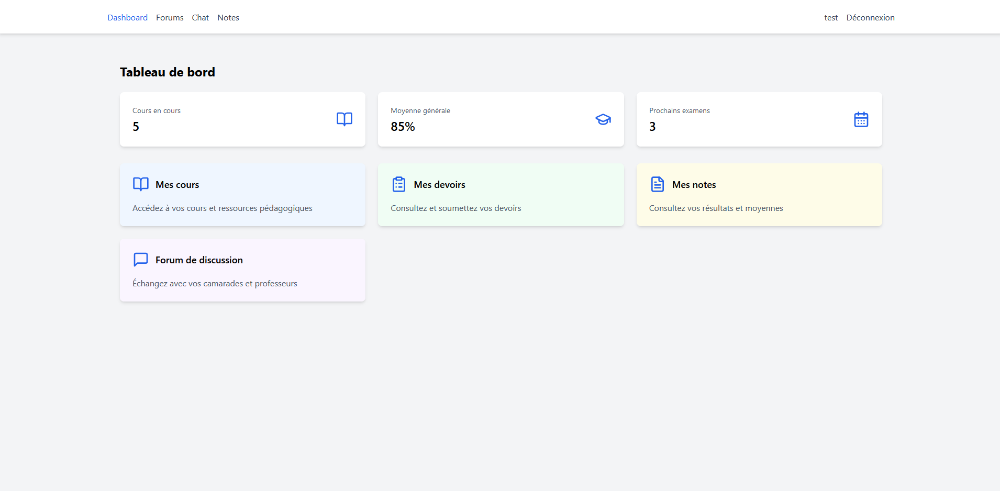
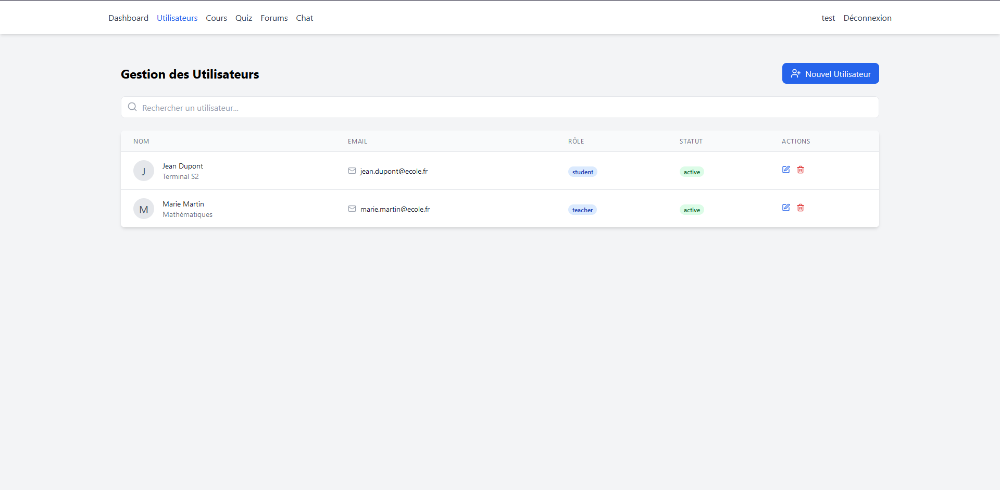
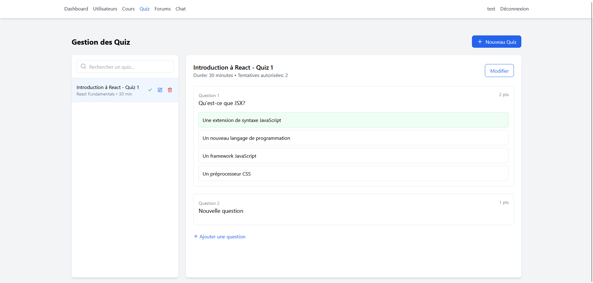

# 🏫 Système de Gestion Scolaire 
 
Une application web moderne et intuitive pour la gestion complète d'établissements scolaires, développée avec React, TypeScript et Vite. 
 
## ✨ Fonctionnalités 
 
### 👥 Gestion des Utilisateurs 
- Multi-rôles (Admin, Enseignant, Étudiant, Responsable Scolarité) 
- Authentification sécurisée 
- Gestion des permissions 
 
### 📚 Gestion Académique 
- Structure académique (filières, niveaux, classes) 
- Affectation des enseignants 
- Emplois du temps 
- Suivi des cours 
 
### 📊 Suivi Pédagogique 
- Gestion des notes 
- Création de quiz 
- Suivi des devoirs 
- Rapports de progression 
 
### 💬 Communication 
- Forums de discussion 
- Messagerie instantanée 
- Notifications 
 
## 🛠 Technologies Utilisées 
 
- **Frontend:** 
  - React 18 
  - TypeScript 
  - Tailwind CSS 
  - Lucide Icons 
  - React Router DOM 
 
  - Vite 
  - ESLint 
  - PostCSS 
 
## 🚀 Installation 
 
1. Cloner le repository 
```bash 
git clone https://github.com/keizenx/Online-School.git 
``` 
 
2. Installer les dépendances 
```bash 
cd Online-School 
pnpm install 

# Dépendances principales 
pnpm add react@18.2.0 react-dom@18.2.0 react-router-dom@6.21.1 @heroicons/react@2.2.0 

# Dépendances de développement 
pnpm add -D @types/react@18.2.43 @types/react-dom@18.2.17 @vitejs/plugin-react@4.2.1 typescript@5.2.2 vite@5.0.8 autoprefixer@10.4.16 postcss@8.4.32 tailwindcss@3.4.0 
``` 
 
3. Lancer l'application 
```bash 
pnpm run dev 
``` 
 
## 📁 Structure du Projet 
 
``` 
src/ 
├── components/          # Composants réutilisables 
│   ├── academic/       # Composants de gestion académique 
│   ├── admin/          # Composants d'administration 
│   ├── courses/        # Composants de gestion des cours 
│   └── planning/       # Composants de planning 
├── pages/              # Pages principales 
├── utils/              # Utilitaires et helpers 
└── config/             # Fichiers de configuration 
``` 
 
## 🔐 Rôles et Permissions 
 
- **Administrateur** 
  - Gestion complète des utilisateurs 
  - Configuration du système 
  - Accès à toutes les fonctionnalités 
 
- **Responsable Scolarité** 
  - Gestion de la structure académique 
  - Affectation des enseignants 
  - Gestion des emplois du temps 
 
- **Enseignant** 
  - Gestion des cours 
  - Création de quiz 
  - Notation des élèves 
 
- **Étudiant** 
  - Consultation des cours 
  - Passage des quiz 
  - Consultation des notes 
 
## 📱 Captures d'écran 
 
 
 
 
 
## 📊 Diagrammes du Projet

### Diagramme de Cas d'Utilisation


### Diagramme de Classe


### Diagramme d'Activité


### Diagramme de Séquence


## 🤝 Contribution 
 
Les contributions sont les bienvenues ! N'hésitez pas à : 
1. Fork le projet 
2. Créer une branche (`git checkout -b feature/AmazingFeature`) 
3. Commit vos changements (`git commit -m 'Add some AmazingFeature'`) 
4. Push sur la branche (`git push origin feature/AmazingFeature`) 
5. Ouvrir une Pull Request 
 
## 📄 Licence 
 
Distribué sous la licence MIT. Voir `LICENSE` pour plus d'informations. 
 
## 📞 Contact 
 
(https://X.com/keizensberg) - franckbello0@gmail.com 
 
Lien du projet: [https://github.com/keizenx/Online-School](https://github.com/keizenx/Online-School) 
 
